  

    

       
      
  

|     | <h2>Hi, I'm luis</h2> A 18 year-old Swiss apprentice in Software Developement    - 🛠 Currently learning Rust & Svelte - 👨‍💻 Started learning programming when I started my apprenticeship - 📡 I enjoy gaming, anime, calisthenics - 👋 Add me on Discord: luiis#0859 |
| ------------- | ------------- |

    
  

  
    
  

  
  ### ✨ Skills
  
  | Skills | Tools |
  |  :-:   |  :-:  |
  | **🌏 Frontend development** |    |
  | **🛠 Backend development** |    |
  | **🔮 Also experienced in** |  |
  
  
   
   
   
  

   
  
  

  

